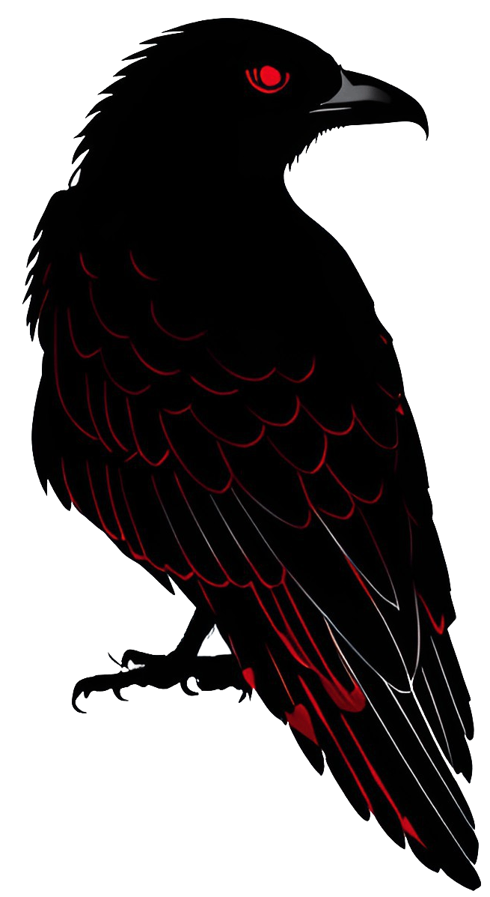

<h4 align="center"></h4>
<h3 align="center">OSINT, Computer science, Cyber security, Digital forensics and Malware analisys</h3>
 

<h4 align="center">
  
  
   
  
  
  
  
  
    
</h4>
 

contact for development services: cipher.contact@proton.me
 
Monero donate:
